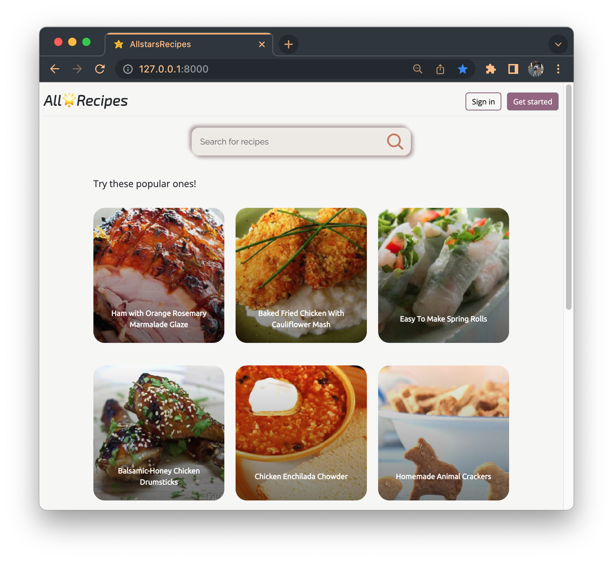
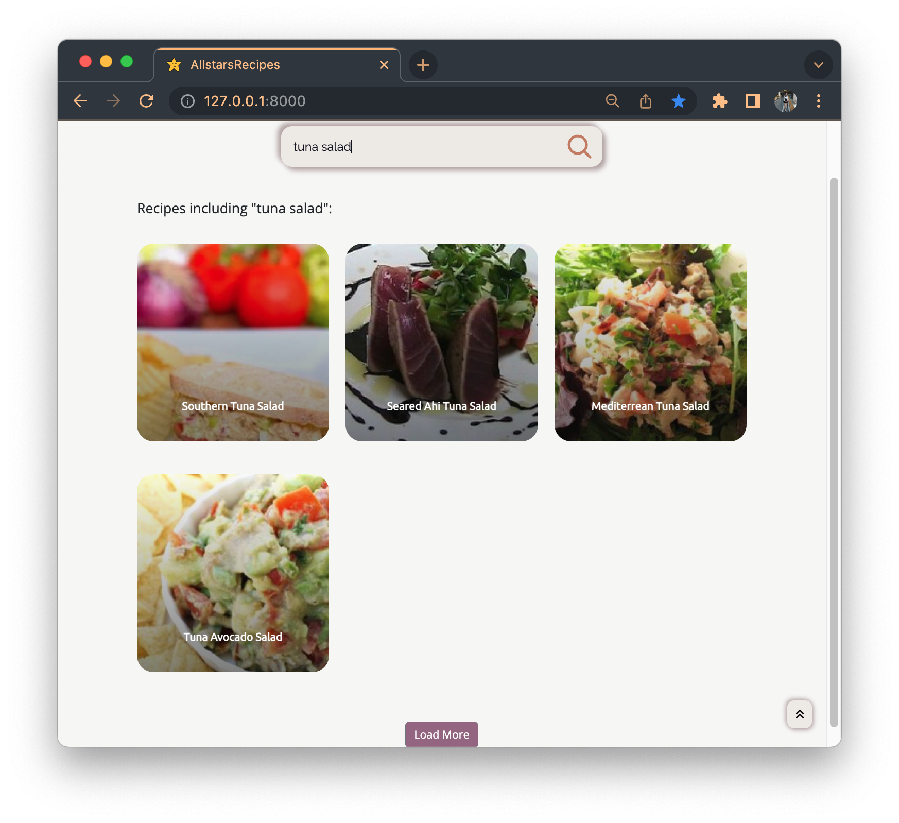
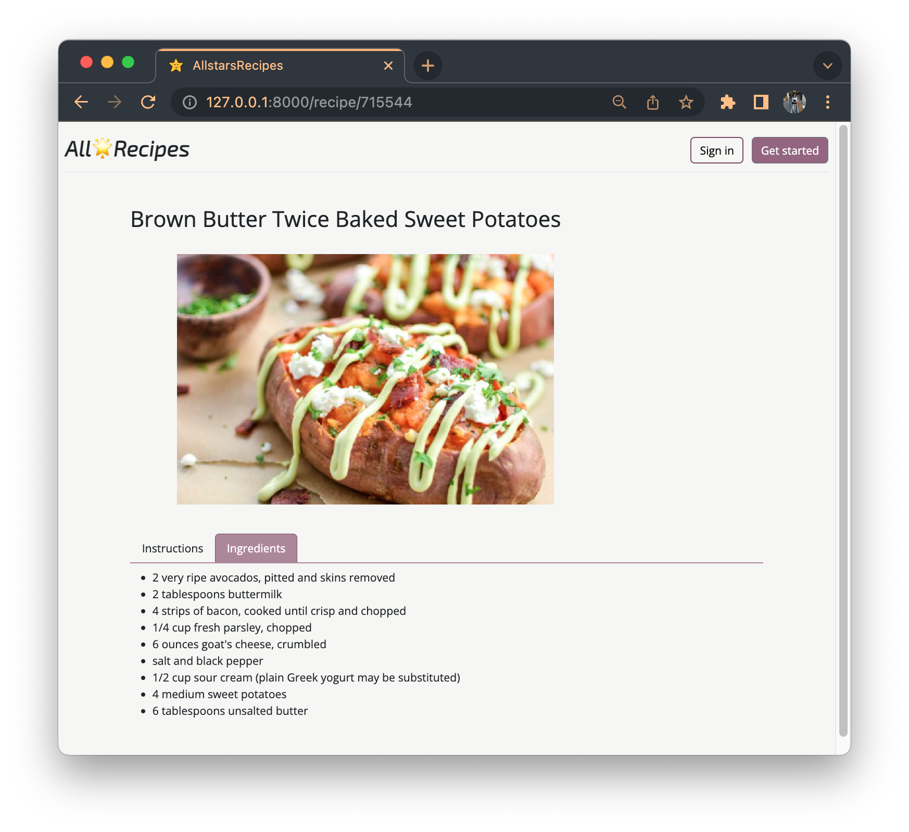
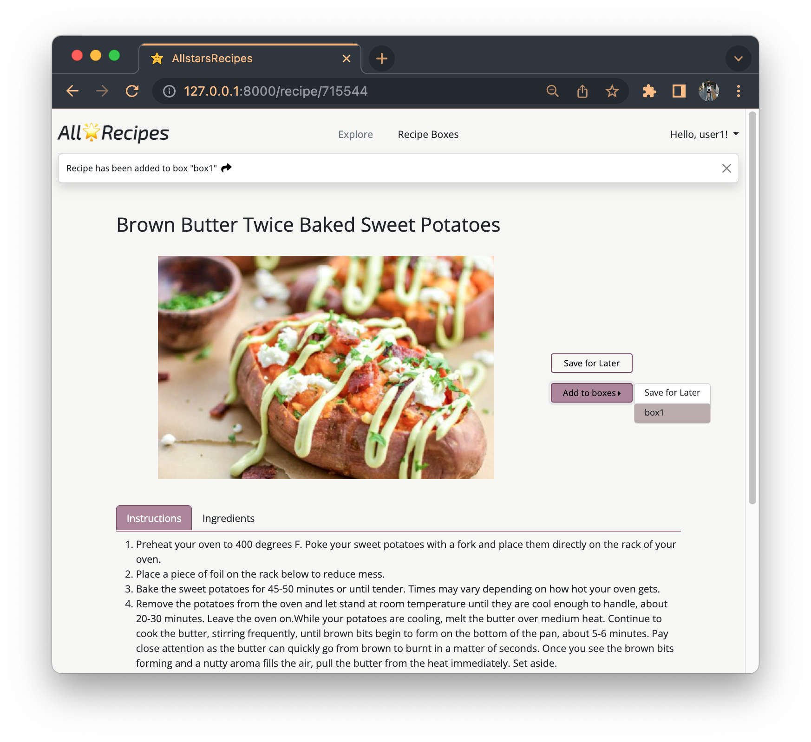
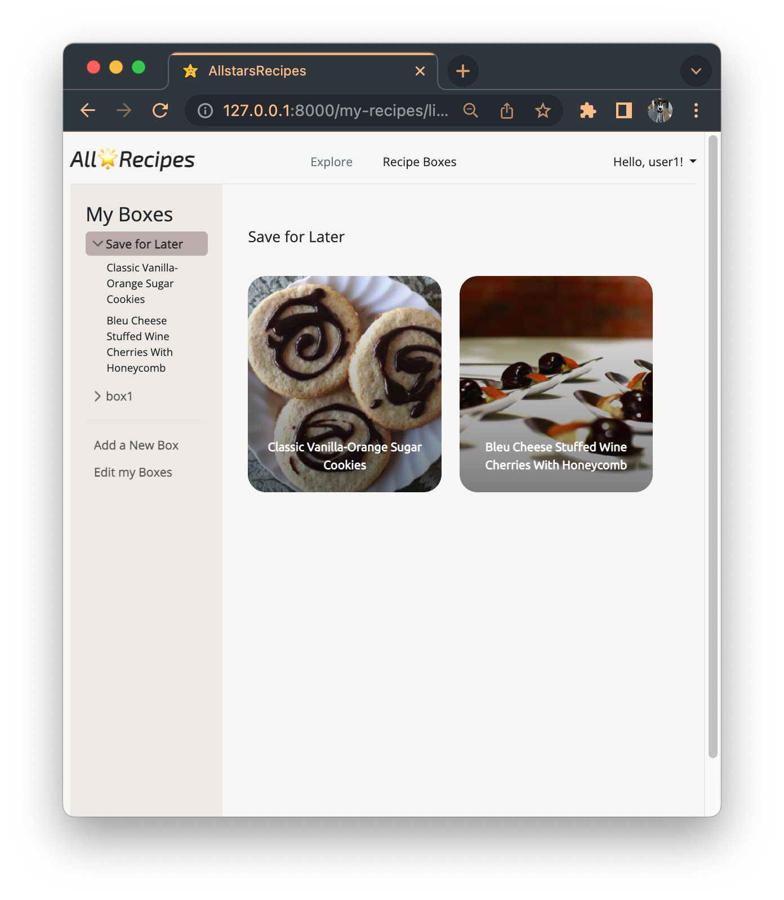
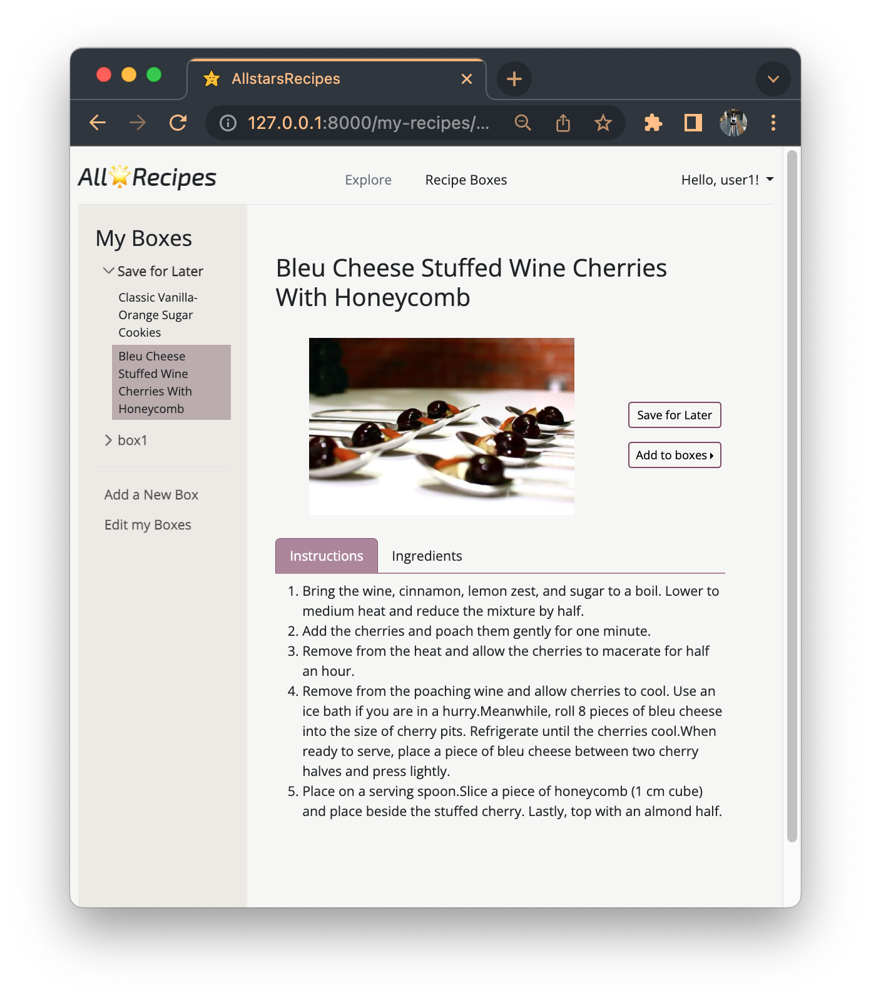
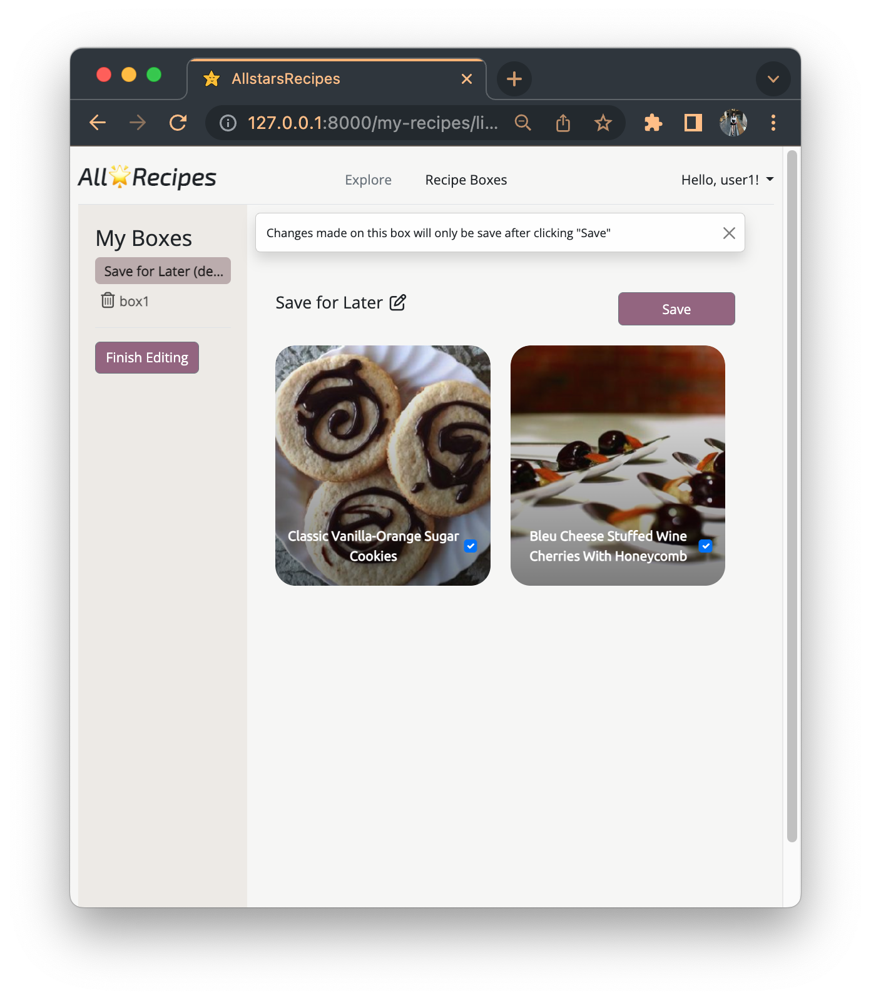

# All:star2:Recipes

This is my capstone project for CS50's Web Programming with Python and JavaScript course. I have designed and developed a full-stack recipe web application named AllstarsRecipes, which allows users to explore and search for their desired recipes, and create collections to save them for later use.

**:computer: View Course [here](https://www.edx.org/course/cs50s-web-programming-with-python-and-javascript)**

**:arrow_forward: View Live Site [here](https://allstarsrecipes.up.railway.app/)**

<!-- **:arrow_forward: View Live Demo [here](https://youtu.be/T8J3SDf6wO0)** -->

&nbsp;

<!-- TABLE OF CONTENTS -->

  
 Table of Contents

  <ol>
    <li>
      <a href="#about-the-project">About The Project</a>
    </li>
    <li>
      <a href="#getting-started">Getting Started</a>
    </li>
    <li><a href="#round_pushpin-main-features">Main Features</a></li>
    <li><a href="#open_file_folder-project-structure">Project Structure</a></li>
    <li><a href="#acknowledgments">Acknowledgments</a></li>
  </ol>

&nbsp;

### About the Project

AllstarsRecipes is a recipe web app where users can browse and search for their favorite recipes, and create lists to keep track of them. This full-stack application is built using Django for the back-end and React for the front-end.

Django is a powerful Python framework that allows for efficient development and organization of the application's back-end. It is used to manage the URL routing, database models, views, templates, and user authentication. React serves as the front-end and handles the user interface, getting and setting data via requests to the Django API on the back-end.

Detailed recipes are acquired by accessing the [Spoonacular API](https://spoonacular.com/food-api).

##### Built With

- Django
- React
- Bootstrap

&nbsp;

<!-- GETTING STARTED -->

## Getting Started

##### Requirements

- Python3
- Django

##### Run

1. Ensure that you have all of the necessary Python packages (see requirements.txt)
2. Navigate to the project directory, and run the server
   `python3 manage.py runserver`

&nbsp;

<!-- MAIN FEATURES -->

## :round_pushpin: Main Features

- **Index Page**

  - **Search**: Users can type a query into the search box to search for recipes.
  - **Displaying Recipes**: By default, the home page displays 12 random recipes. When a user searches a query, the site will show the desired recipes without reloading the page.
  - **Load More**: This button allows users to load additional recipes, and is hidden if all recipes have been listed.
  - **Scroll to Top**: This button allows users to quickly return to the top of the page.
  

       
      
  

   

- **Recipe Page**

  - **Access**: Users can visit a recipe page from both the home page and the boxes page by clicking on the recipe's image
  - **Content**: A recipe page contains the title, image, instructions, and ingredients for a recipe.
  - **Add to Boxes**: If the user is signed in, they can save the current recipe to their boxes and go to the box page with a single click.
  

     
    
  

   

- **User Boxes Page**

  - **Registered-user only**: The User Boxes page is only accessible to registered users. Once a user is registered, a default box called 'Save for Later' is created for them.
  - **Create a box**: Users are able to create a new box.
  - **Edit boxes**: Users are able to change the title or remove recipes from all boxes. They can also delete any user-created boxes.
  - **Sidebar**: The sidebar allows users to select either a box or a specific recipe within a box, and the content on the right will change accordingly. The sidebar also updates any changes made to the list of boxes, such as creating or editing boxes.
  

     
    
    
  

&nbsp;

<!-- PROJECT STRUCTURE -->

## :open_file_folder: Project Structure

- `./capstone/` : project file, contains all the configuration files of the project

  - `setting.py`: main setting file, used for adding all applications and middleware applications
  - `.env`: contains all the environment variables
  - `urls.py`: contains all the endpoints, naming endpoints for backend and frontend app

- `./backend/` : backend app

  - `apps.py`: app configuration
  - `models.py`: contains all the models created for this project
  - `urls.py`: contains all the API routes and user authentication routes
  - `views.py`: contains all the API views and user authentication functions

- `./frontend/` : frontend app built with React

  - `src/`: contains all the source code of the frontend app, which will be generated into a single JavaScript file

    - `index.js`: entry point of the React app, which links the user’s URL request to the corresponding pages
    - `pages/`: each page renders a block of HTML code which will later be inserted into `index.js` and then `index.html`
    - `components/`: re-usable functions that can be called in any pages
    - `constants/`: contains the universal variables for frontend, such as the urls for API

  - `static/`: contains all the images, CSS, and JS files
  - `templates/frontend/`: contains the layout and index HTML files
  - `babel.config.json` & `package.json` & `webpack.config.js`: configuration files needed to set up React inside Django app
  - `urls.py`: contains all the frontend paths managed by React
  - `views.py`: contains all the functions to render HTMLs and authenticate users

- `manage.py`: a command-line utility to run commands like `runserver`, `makemigrations`, and `migrate`
- `./screenshots/` : all the screenshots to illustrate the features of the application
- `Procfile` & `runtime.txt` & `staticfiles/`: files required for deploying the app on Railway

&nbsp;

<!-- ACKNOWLEDGMENTS -->

## Acknowledgments

- [GitHub Emoji Cheat Sheet](https://www.webpagefx.com/tools/emoji-cheat-sheet)
- [Font Awesome](https://fontawesome.com)
- [Google Font](https://fonts.google.com/)
- [Railway](https://railway.app/)
